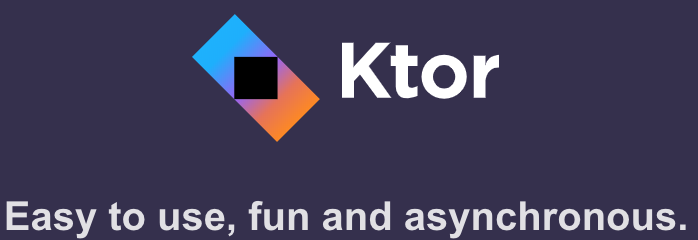
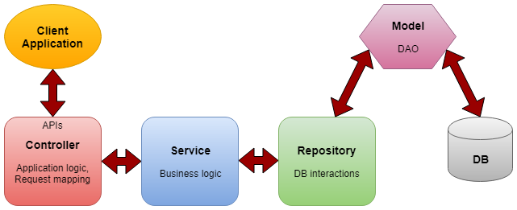
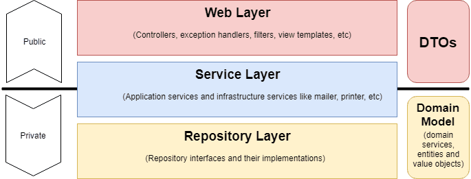
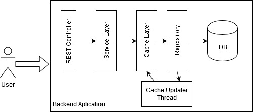

# Tenistas REST Ktor

Api REST de Tenistas con Ktor para Programación de Servicios y Procesos de 2º de DAM. Curso 2022/2023

[](https://kotlinlang.org/)
[](https://joseluisgs.dev/docs/license/)




- [Tenistas REST Ktor](#tenistas-rest-ktor)
  - [Descripción](#descripción)
    - [Advertencia](#advertencia)
    - [Tecnologías](#tecnologías)
  - [Dominio](#dominio)
    - [Representante](#representante)
    - [Raqueta](#raqueta)
  - [Proyectos y documentación anteriores](#proyectos-y-documentación-anteriores)
  - [Arquitectura](#arquitectura)
  - [Endpoints](#endpoints)
    - [Representantes](#representantes)
  - [Ktor](#ktor)
    - [Creando un proyecto](#creando-un-proyecto)
    - [Punto de Entrada](#punto-de-entrada)
    - [Parametrizando la aplicación](#parametrizando-la-aplicación)
    - [Creando rutas](#creando-rutas)
      - [Type-Safe Routing y Locations](#type-safe-routing-y-locations)
    - [Serialización y Content Negotiation](#serialización-y-content-negotiation)
    - [Responses](#responses)
      - [Enviando datos serializados](#enviando-datos-serializados)
    - [Requests](#requests)
      - [Parámetros de ruta](#parámetros-de-ruta)
      - [Parámetros de consulta](#parámetros-de-consulta)
      - [Peticiones datos serializados](#peticiones-datos-serializados)
      - [Peticiones con formularios](#peticiones-con-formularios)
      - [Peticiones multiparte](#peticiones-multiparte)
      - [Request validation](#request-validation)
  - [Caché](#caché)
  - [Recursos](#recursos)
  - [Autor](#autor)
    - [Contacto](#contacto)
    - [¿Un café?](#un-café)
  - [Licencia de uso](#licencia-de-uso)

## Descripción

El siguiente proyecto es una API REST de Tenistas con Ktor para Programación de Servicios y Procesos de 2º de DAM. Curso
2022/2023. En ella se pretende crear un servicio completo para la gestión de tenistas, raquetas y representantes de
marcas de raquetas.

El objetivo es que el alumnado aprenda a crear un servicio REST con Ktor, con las operaciones CRUD, securizar el
servicio con JWT y usar un cliente para consumir el servicio. Se pretende que el servicio completo sea asíncrono y reactivo en lo máximo posible agilizando el servicio mediante una caché.

Además que permita escuchar cambios en tiempo real usando websocket

Se realizará inyección de dependencias y un sistema de logging.

Tendrá una página web de presentación como devolución de recursos estáticos.

### Advertencia
Esta API REST no está pensada para ser usada en producción. Es un proyecto de aprendizaje y por tanto algunas cosas no se profundizan y otras están pensadas para poder realizarlas en clase de una manera más simple con el objetivo que el alumnado pueda entenderlas mejor. No se trata de montar la mejor arquitectura o el mejor servicio, sino de aprender a crear un servicio REST en el tiempo exigido por el calendario escolar.

Este proyecto está en constante evolución y se irán añadiendo nuevas funcionalidades y mejoras para el alumnado. De la misma manera se irá completando la documentación asociada. 

Si quieres colaborar, puedes hacerlo contactando [conmigo](#contacto).

### Tecnologías

- Servidor Web: [Ktor](https://ktor.io/) - Framework para crear servicios web en Kotlin asíncronos y multiplataforma.
- Autenticación: [JWT](https://jwt.io/) - JSON Web Token para la autenticación y autorización.
- Encriptado: [Bcrypt](https://en.wikipedia.org/wiki/Bcrypt) - Algoritmo de hash para encriptar contraseñas.
- Proveedor de dependencias: [Koin](https://insert-koin.io/) - Framework para la inyección de dependencias.
- Asincronía: [Coroutines](https://kotlinlang.org/docs/coroutines-overview.html) - Librería de Kotlin para la programación asíncrona.
- Logger: [Kotlin Logging](https://github.com/MicroUtils/kotlin-logging) - Framework para la gestión de logs.
- Caché: [Cache4k](https://reactivecircus.github.io/cache4k/) - Versión 100% Kotlin asíncrona y multiplataforma de [Caffeine](https://github.com/ben-manes/caffeine).

## Dominio

Gestionar tenistas, raquetas y representantes de marcas de raquetas. Sabemos que:
- Una raqueta tiene un representante y el representante es solo de una marca de raqueta (1-1). No puede haber raquetas sin representante y no puede haber representantes sin raquetas.
- Un tenista solo puede o no tener contrato con una raqueta y una raqueta o modelo de raqueta puede ser usada por varios tenistas (1-N). Puede haber tenistas sin raqueta y puede haber raquetas sin tenistas.

### Representante

| Campo | Tipo | Descripción |
| --- | --- | --- |
| id | UUID | Identificador único |
| nombre | String | Nombre del representante |
| email | String | Email del representante |

### Raqueta
| Campo | Tipo | Descripción |
| --- | --- | --- |
| id | UUID | Identificador único |
| marca | String | Marca de la raqueta |
| precio | Double | Precio de la raqueta |
| representante | Representante | Representante de la raqueta (no nulo) |

## Proyectos y documentación anteriores
Parte de los contenidos a desarrollar en este proyecto se han desarrollado en proyectos anteriores. En este caso:
- [Kotlin-Ktor-REST-Service](https://github.com/joseluisgs/Kotlin-Ktor-REST-Service)
- [SpringBoot-Productos-REST-DAM-2021-2022](https://github.com/joseluisgs/SpringBoot-Productos-REST-DAM-2021-2022)

Para la parte de reactividad te recomiendo leer: ["Ya no sé programar si no es reactivo"](https://joseluisgs.dev/blogs/2022/2022-12-06-ya-no-se-programar-sin-reactividad.html)

## Arquitectura
Nos centraremos en la arquitectura de la API REST. Para ello, usaremos el patrón de diseño MVC (Modelo Vista Controlador) en capas.





## Endpoints
Los endpoints que vamos a usar son los siguientes:
### Representantes
| Método | Endpoint | Auth | Descripción | Status Code | Content |
| ------ | -------- | ---- | ----------- | ----------- | ------- |
| GET | /api/representantes | No | Devuelve todos los representantes | 200 | JSON |
| GET | /api/representantes?page=X&perPage=Y | No | Devuelve representantes paginados | 200 | JSON |
| GET | /api/representantes/{id} | No | Devuelve un representante por su id | 200 | JSON |
| POST | /api/representantes | No | Crea un nuevo representante | 201 | JSON |
| PUT | /api/representantes/{id} | No | Actualiza un representante por su id | 200 | JSON |
| DELETE | /api/representantes/{id} | No | Elimina un representante por su id | 204 | No Content |
| GET | /api/representantes/find/nombre=X | No | Devuelve los representantes con nombre X | 200 | JSON |


## Ktor

[Ktor](https://ktor.io/) es el framework para desarrollar servicios y clientes asincrónicos. Es
100% [Kotlin](https://kotlinlang.org/) y se ejecuta en
usando [Coroutines](https://kotlinlang.org/docs/coroutines-overview.html). Admite proyectos multiplataforma, lo que
significa que puede usarlo para cualquier proyecto dirigido a JVM, Android, iOS, nativo o Javascript. En este proyecto
aprovecharemos Ktor para crear un servicio web para consumir una API REST. Además, aplicaremos Ktor para devolver
páginas web.


### Creando un proyecto
Podemos crear un proyecto Ktor usando el plugin IntelliJ, desde su web. Con estos [asistentes](https://ktor.io/create/) podemos crear un proyecto Ktor con las opciones que queramos, destacamos el routing, el uso de json, etc.

### Punto de Entrada

El servidor tiene su entrada y configuración en la clase Application. Esta lee la configuración en base
al [fichero de configuración](./src/main/resources/application.conf) y a partir de aquí se crea una instancia de la
clase Application en base a la configuración de module().

### Parametrizando la aplicación
Podemos parametrizar la aplicación usando el fichero de configuración. En este caso, usaremos el fichero de configuración .conf y puede ser en distintos formatos, como JSON, YAML o HOCON. En este caso, usaremos HOCON. En este fichero de configuración podemos definir distintas propiedades, como el puerto de escucha, el host, el tiempo de expiración del token JWT, o el modo [Auto-Reload](https://ktor.io/docs/auto-reload.html), etc. En este caso, usaremos el siguiente fichero de configuración:

```hocon
ktor {
    ## Para el puerto
    deployment {
        port = 6969
        port = ${?PORT}
    }

    ## Para la clase principal
    application {
        modules = [ joseluisgs.es.ApplicationKt.module ]
    }

    ## Modo de desarrollo, se dispara cuando detecta cambios
    ## development = true
    deployment {
        ## Directorios a vigilar
        watch = [ classes, resources ]
    }

    ## Modo de ejecución
    environment = dev
    environment = ${?KTOR_ENV}
}
```

### Creando rutas

Las [rutas](https://ktor.io/docs/routing-in-ktor.html) se definen creando una función de extensión sobre Route. A su vez, usando DSL se definen las rutase en base a
las petición HTTP sobre ella. Podemos responder a la petición usando call.respondText(), para texto; call.respondHTML(),
para contenido HTML usando [Kotlin HTML DSL](https://github.com/Kotlin/kotlinx.html); o call.respond() para devolver una
respuesta en formato JSON o XML.
finalmente asignamos esas rutas a la instancia de Application, es decir, dentro del método module(). Un ejemplo de ruta
puede ser:

```kotlin
routing {
    // Entrada en la api
    get("/") {
        call.respondText("👋 Hola Kotlin REST Service con Kotlin-Ktor")
    }
}
```
#### Type-Safe Routing y Locations
Ktor te permite hacer [Type-Safe Routing](https://ktor.io/docs/type-safe-routing.html), es decir, que puedes definir una clase que represente una ruta y que tenga las operaciones a realizar. 

También podemos crear rutas de manera tipada con [Locations](https://ktor.io/docs/locations.html), pero esta siendo sustituida por Type-Safe Routing.


### Serialización y Content Negotiation
Ktor soporta [Content Negotiation](https://ktor.io/docs/serialization.html), es decir, que puede aceptar peticiones y respuestas distintos tipos de contenido, como JSON, XML, HTML, etc. En este caso, usaremos JSON. Para ello, usaremos la librería [Kotlinx Serialization](https://kotlinlang.org/docs/serialization.html)
```kotlin
install(ContentNegotiation) {
    json(Json {
        prettyPrint = true
        isLenient = true
    })
}
```

### Responses
En Ktor podemos mandar distintos tipos de [respuesta](https://ktor.io/docs/responses.html), así como distintos códigos de [estado](https://ktor.io/docs/responses.html#status).
```kotlin
call.respondText("👋 Hola Kotlin REST Service con Kotlin-Ktor")
call.respond(HttpStatusCode.OK, "👋 Hola Kotlin REST Service con Kotlin-Ktor")
call.respond(HttpStatusCode.NotFound, "No encontrado")
```
#### Enviando datos serializados
Simplemente usa una data class y la función call.respond() para enviar datos serializados. En este caso, usaremos la librería [Kotlinx Serialization](https://kotlinlang.org/docs/serialization.html)
```kotlin
@Serializable
data class Customer(val id: Int, val firstName: String, val lastName: String)

get("/customer") {
    call.respond(Customer(1, "José Luis", "García Sánchez"))
}
```
### Requests
En Ktor podemos recibir distintos tipos de [peticiones](https://ktor.io/docs/requests.html).

#### Parámetros de ruta
Podemos obtener los parámetros del Path, con parameters, como en el siguiente ejemplo, siempre y cuando estén definidos en la ruta {param}:

```kotlin
get("/hello/{name}") {
    val name = call.parameters["name"]
    call.respondText("Hello $name!")
}
```

#### Parámetros de consulta
Podemos obtener los parámetros de la Query, con queryParameters, si tenemos por ejemplo la siguiente ruta: /products?price=asc&category=1:

```kotlin
get("/products") {
    val price = call.request.queryParameters["price"]
    val category = call.request.queryParameters["category"]
    call.respondText("Price: $price, Category: $category")
}
```

#### Peticiones datos serializados
Para recibir datos serializados, usa la función call.receive() y la data class que representa el tipo de datos que se espera recibir con la que casteamos el body de la petición. En este caso, usaremos la librería [Kotlinx Serialization](https://kotlinlang.org/docs/serialization.html)
```kotlin
@Serializable
data class Customer(val id: Int, val firstName: String, val lastName: String)

post("/customer") {
    val customer = call.receive<Customer>()
    call.respondText("Customer: $customer")
}
```

#### Peticiones con formularios
Ktor soporta [peticiones con formularios](https://ktor.io/docs/requests.html#form_parameters), es decir, que podemos enviar datos de un formulario. 
```kotlin
post("/signup") {
    val formParameters = call.receiveParameters()
    val username = formParameters["username"].toString()
    call.respondText("The '$username' account is created")
}
```

#### Peticiones multiparte
Ktor soporta [peticiones multipartes](https://ktor.io/docs/requests.html#form_data), es decir, que podemos enviar ficheros, imágenes, etc. 
```kotlin
post("/upload") {
    //  multipart data (suspending)
    val multipart = call.receiveMultipart()
    multipart.forEachPart { part ->
      val fileName = part.originalFileName as String
      var fileBytes = part.streamProvider().readBytes()
      File("uploads/$fileName").writeBytes(fileBytes)
      part.dispose()
    }
    call.respondText("$fileName is uploaded to 'uploads/$fileName'")
}
```

#### Request validation
Ktor tiene una [API de validación](https://ktor.io/docs/request-validation.html) que nos permite validar los datos del body de una petición. En este caso lanzando RequestValidationException si no es correcto.
```kotlin
install(RequestValidation) {
    validate<Customer> { customer ->
        if (customer.id <= 0)
            ValidationResult.Invalid("A customer ID should be greater than 0")
        else ValidationResult.Valid
    }
}
```

## Caché
La [caché](https://es.wikipedia.org/wiki/Cach%C3%A9_(inform%C3%A1tica)) es una forma de almacenar datos en memoria/disco para que se puedan recuperar rápidamente. Además de ser una forma de optimizar el rendimiento, también es una forma de reducir el coste de almacenamiento de datos y tiempo de respuesta pues los datos se almacenan en memoria y no en disco o base de datos que pueden estar en otro servidor y con ello aumentar el tiempo de respuesta. 

Además la caché nos ofrece automáticamente distintos mecanismos de actuación, como por ejemplo, que los elementos en cache tenga un tiempo de vida máximo y se eliminen automáticamente cuando se cumpla. Lo que nos permite tener datos actualizados Y/o los más usados en memoria y eliminar los que no se usan.

En nuestro proyecto tenemos dos repositorios, uno para la caché y otro para la base de datos. Para ello todas las consultas usamos la caché y si no está, se consulta a la base de datos y se guarda en la caché. Además, podemos tener un proceso en background que actualice la caché cada cierto tiempo.

Además, hemos optimizado las operaciones con corrutinas para que se ejecuten en paralelo actualizando la caché y la base de datos.

El diagrama seguido es el siguiente




## Recursos

- Twitter: https://twitter.com/joseluisgonsan
- GitHub: https://github.com/joseluisgs
- Web: https://joseluisgs.github.io
- Discord del módulo: https://discord.gg/RRGsXfFDya
- Aula DAMnificad@s: https://discord.gg/XT8G5rRySU

## Autor

Codificado con :sparkling_heart: por [José Luis González Sánchez](https://twitter.com/joseluisgonsan)

[](https://twitter.com/joseluisgonsan)
[](https://github.com/joseluisgs)
[](https://github.com/joseluisgs)

### Contacto

<p>
  Cualquier cosa que necesites házmelo saber por si puedo ayudarte 💬.
</p>
<p>
 <a href="https://joseluisgs.github.io/" target="_blank">
        
    </a>  &nbsp;&nbsp;
    <a href="https://github.com/joseluisgs" target="_blank">
        
    </a> &nbsp;&nbsp;
        <a href="https://twitter.com/joseluisgonsan" target="_blank">
        
    </a> &nbsp;&nbsp;
    <a href="https://www.linkedin.com/in/joseluisgonsan" target="_blank">
        
    </a>  &nbsp;&nbsp;
    <a href="https://discordapp.com/users/joseluisgs#3560" target="_blank">
        
    </a> &nbsp;&nbsp;
    <a href="https://g.dev/joseluisgs" target="_blank">
        
    </a>  &nbsp;&nbsp;
<a href="https://www.youtube.com/@joseluisgs" target="_blank">
        
    </a>  
</p>

### ¿Un café?

<p><a href="https://www.buymeacoffee.com/joseluisgs"> </a></p><br><br><br>

## Licencia de uso

Este repositorio y todo su contenido está licenciado bajo licencia **Creative Commons**, si desea saber más, vea
la [LICENSE](https://joseluisgs.dev/docs/license/). Por favor si compartes, usas o modificas este proyecto cita a su
autor, y usa las mismas condiciones para su uso docente, formativo o educativo y no comercial.

<a rel="license" href="http://creativecommons.org/licenses/by-nc-sa/4.0/"></a><br /><span xmlns:dct="http://purl.org/dc/terms/" property="dct:title">
JoseLuisGS</span>
by <a xmlns:cc="http://creativecommons.org/ns#" href="https://joseluisgs.dev/" property="cc:attributionName" rel="cc:attributionURL">
José Luis González Sánchez</a> is licensed under
a <a rel="license" href="http://creativecommons.org/licenses/by-nc-sa/4.0/">Creative Commons
Reconocimiento-NoComercial-CompartirIgual 4.0 Internacional License</a>.<br />Creado a partir de la obra
en <a xmlns:dct="http://purl.org/dc/terms/" href="https://github.com/joseluisgs" rel="dct:source">https://github.com/joseluisgs</a>.
